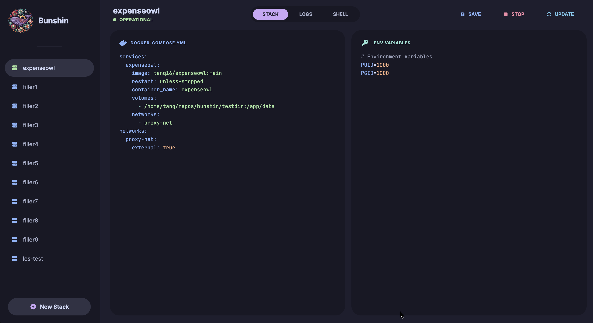
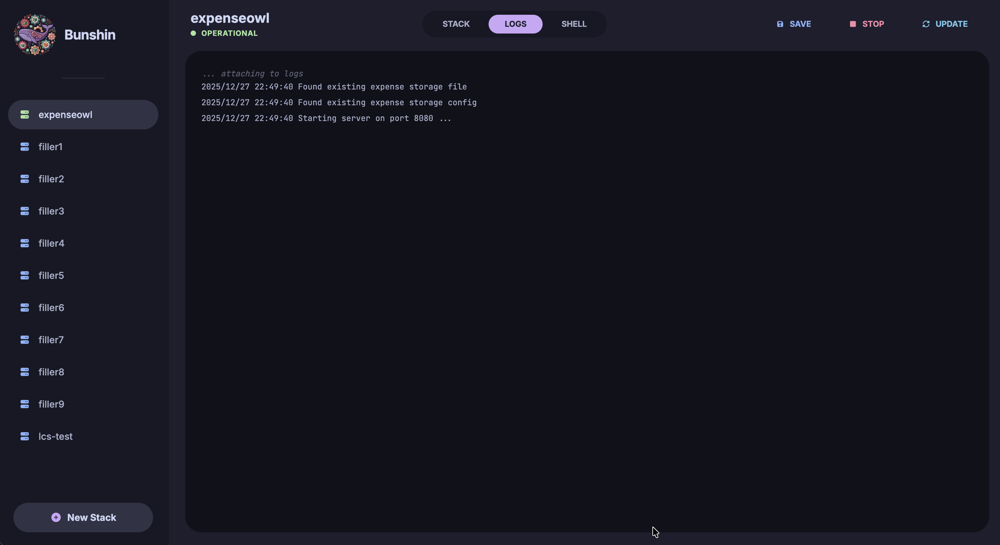

<div align="center">
  
  <h1>Bunshin</h1>

  <a href="https://github.com/tanq16/bunshin/actions/workflows/release.yml"></a>&nbsp;<a href="https://github.com/tanq16/bunshin/releases"></a>&nbsp;<a href="https://hub.docker.com/r/tanq16/bunshin"></a><br><br>
</div>

A fast, simple, self-hosted, no-nonsense Docker compose stack manager. The name is inspired from `Kage Bunshin` from Naruto and the app is heavily influenced by [Dockge](https://github.com/louislam/dockge).

I wanted something that was dead simple and provides an elegant web-based interface for managing Docker compose stacks with disk-encrypted environment variables. I also needed the logs and shell capabilities, but I needed everything packaged in a tiny working environment, which is made possible with Go.

## Features

- Beautiful Catppuccin Mocha themed web interface for managing stacks
- Simplified compose schema that directly maps to Docker container configurations
- Real-time container logs streaming via web sockets
- Interactive shell access to containers via web sockets with xterm.js
- Encrypted environment variable storage using AES-GCM with PBKDF2 key derivation
- YAML and INI syntax highlighting for stack and environment file editing
- Status monitoring with automatic status refresh
- Support for volumes, ports, networks, and network modes
- Automatic image pulling on update with automated dangling image cleanup
- Fully self-hosted with embedded frontend assets and self-contained binary
- Efficient and tiny size for both binary and container

## Screenshots

<div align="center">

| | | |
|---|---|---|
|  |  |  |

</div>

## Usage

### Docker (for Homelab)

```bash
mkdir $HOME/bunshin-data
```
```bash
docker run --rm -d --name bunshin \
  -p 8080:8080 \
  -v $HOME/bunshin-data:/app/data \
  -v /var/run/docker.sock:/var/run/docker.sock \
  -e BUNSHIN_ENV_PW=your-encryption-password \
  tanq16/bunshin:main
```

Available at `http://localhost:8080`. Docker Compose example:

```yaml
services:
  bunshin:
    image: tanq16/bunshin:main
    container_name: bunshin
    volumes:
      - /home/tanq/bunshin-data:/app/data
      - /var/run/docker.sock:/var/run/docker.sock
    environment:
      - BUNSHIN_ENV_PW=your-encryption-password
    ports:
      - 8080:8080
```

> [!NOTE]
> The Docker socket must be shared with the container for Bunshin to manage Docker containers. Environment variables are encrypted on disk using AES-GCM encryption with PBKDF2 key derivation.

### Binary

To use the binary, simply download the latest version from the project releases and run as follows:

```bash
bunshin --data $YOUR_DATA_FOLDER
```

Flags:
- `--data`: data directory path (default: `./data`)

The data directory will contain:
- `stacks/`: YAML stack definitions
- `env/`: Encrypted environment variable files

Environment variable:
- `BUNSHIN_ENV_PW`: Required password for encrypting/decrypting environment variables stored on disk

> [!WARNING]
> Keep your `BUNSHIN_ENV_PW` secure. Without it, encrypted environment variables cannot be decrypted.

### Local Development

Install with Go 1.24+:

```bash
go install github.com/tanq16/bunshin@latest
```

Or build from source:

```bash
git clone https://github.com/tanq16/bunshin.git && \
cd bunshin && \
go build .
```

### Additional Notes

#### Docker SDK

#### Stack Definition Schema

Bunshin uses a simplified compose schema that directly maps to Docker container configurations:

```yaml
services:
  service-name:
    image: image:tag
    container_name: my-container
    environment:
      - KEY=value
    volumes:
      - /host/path:/container/path
    ports:
      - "8080:80"
    networks:
      - network-name
    network_mode: host
```

The schema doesn't orchestrate networks or volumes—it uses what's already available in Docker. This keeps the implementation simple and predictable.

#### Stack Management

**Stack Actions**
- Start: Creates and starts containers from the stack definition
- Stop: Stops and removes all containers in the stack
- Update: Pulls latest images, then recreates containers with new images

**Status Monitoring**
- Status is automatically refreshed every 5 seconds
- Shows "Operational" when containers are running, "Stopped" otherwise

**Logs and Shell**
- Real-time log streaming via web sockets for the first container in the stack
- Interactive shell access via web sockets terminal (xterm.js)
- Both features require the container to be running

#### Container Labeling

All containers managed by Bunshin are labeled with:
- `bunshin.stack=<stack-name>`: Identifies which stack the container belongs to
- `bunshin.managed=true`: Marks the container as managed by Bunshin (not specifically used)

This allows Bunshin to track and manage containers even if they're stopped.

#### Restart Policy

All containers are created with `unless-stopped` restart policy, ensuring they automatically restart on system reboot unless explicitly stopped through Bunshin.
